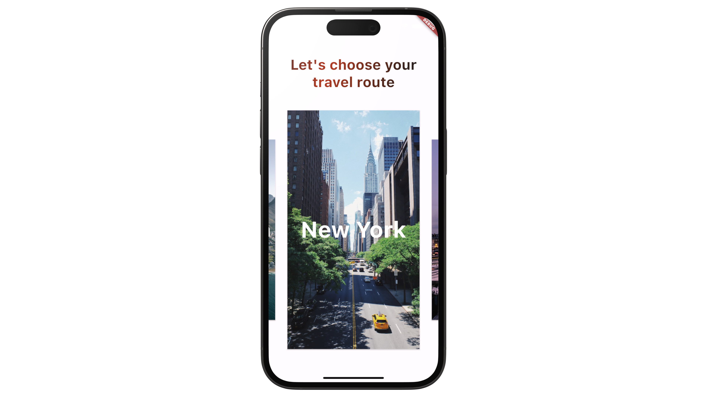
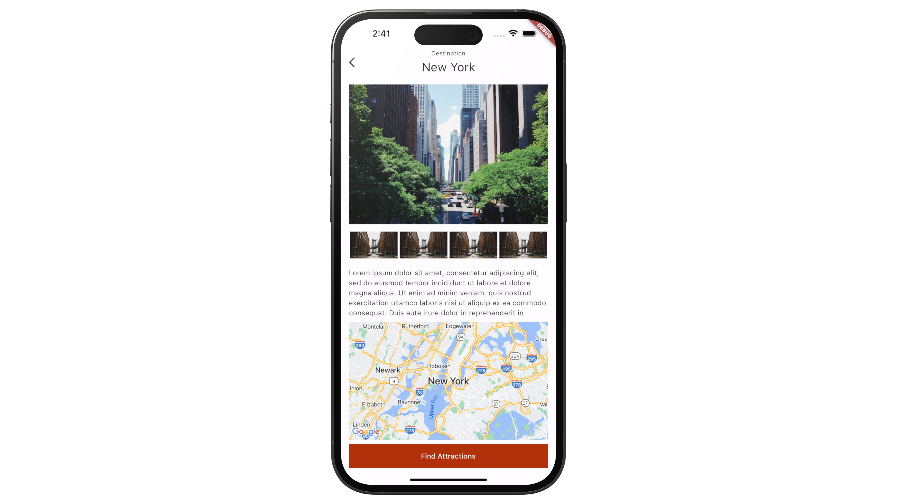
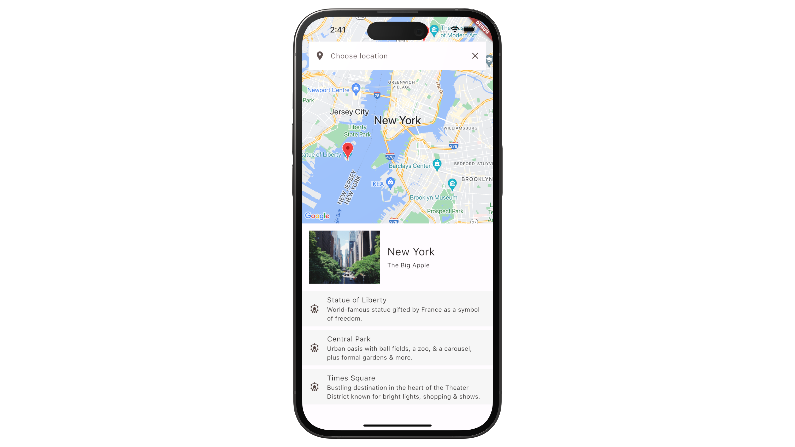
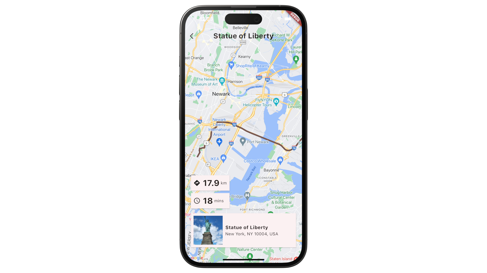

# flutter-apps
A collection of Flutter apps

# Grocery Shopping App with Flutter, Dart Frog and the BLoC Pattern
The project aims to create a grocery shopping platform. It has an intro screen with a background video and other features such as login & registration UIs, a central home screen for popular categories and top-sellers, cart synchronization with Dart Frog server, category browsing, and provisions for search functionality and order tracking.

Despite some features being UI-only, the app fetches product and category data from Dart Frog's backend server. The cart's functionality is integrated with the backend server to store the user cart and persist it across multiple sessions.

The project will receive future updates including adding backend functionality for multiple screens, syncing with an external database, introducing product barcode scanning, and deploying the database and the server to Google Cloud Platform.

### Full code available at: https://sowl.co/s/bm98ky
### Video tutorial: https://youtu.be/eLCUDRvDkoE

## App Screenshots: 
|  |  |
|:---:|:---:|
| Login Screen | Home Screen |
|  |  |
|:---:|:---:|:---:|
| Cart Screen | Order History Screen|

# Travel Routes App with Flutter, Google Maps, Riverpod and flutter_animate
The app leverages Google Maps Platform, creating a robust travel tool. It integrates with Google Maps, displaying user-specific locations and routes and providing real-time geolocation services via the 'geolocator' package. Geocoding API translates coordinates into user-friendly addresses. Detailed location information, including photos and operating hours, is accessible thanks to Places API integration. Users can get routes and directions with Routes API. 

The app utilizes Riverpod for state management. State is stored and updated through providers and notifiers. Additionally, the 'flutter_animate' library enhances the UI with engaging animations, enriching navigation throughout the app. 

### Full code: https://atomsbox.com

## App Screenshots: 
|  |  |
|:---:|:---:|
| Home Screen with City Selection | Destination Screen with City Information | 
|  |  |
| Points of Interest Screen | Map Screen with Navigation Details |
